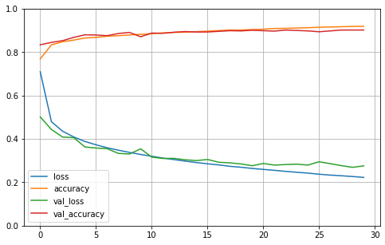

# Introdução

Este notebook visa ser uma introdução ao TensorFlow + Keras. 
Foi desenvolvido a partir do livroHands-On Machine Learning with Scikit-Learn, Keras, and Tensorflow Concepts, Tools, and Techniques to Build Intelligent Systems - Aurélien Géron, comentários são acrescentados para complementar as informações do livro. 

## TensorFlow

TensorFlow é uma biblioteca open source de modelos de aprendizado de máquina, sendo uma das principais tecnologias utilizadas hoje, tanto por empresas como por centros de pesquisa. Possui alto desempenho e muitos recursos para criar e customizar redes neurais. Para mais informações sobre o projeto: https://www.tensorflow.org/?hl=pt-br.

## Keras
Keras é uma API de alto nível para diversas bibliotecas de aprendizado de máquina.
Nesse notebook estamos focando no tf.keras, uma extensão exclusiva para o TensorFlow.
Para mais informação: https://www.tensorflow.org/api_docs/python/tf/keras


```python
#Importando o TensorFlow
import tensorflow as tf
#Importando o Keras
from tensorflow import keras
```


Através do Keras podemos acessar diversas base de dados abertas.
Vamos usar fashion_mnist, um base de dados de peças de roupa.
Possui imagens 28X28 pixels de peças de roupas com as seguintes categorias T-shirt/top, Trouser, Pullover, Dress, Coat,Sandal, Shirt, Sneaker, Bag e Ankle boot.


```python
#Fazendo Donwload do dataset
fashion_mnist = keras.datasets.fashion_mnist
(x_train_full, y_train_full),(x_test, y_test) = fashion_mnist.load_data()
#Legendas dos dados
class_names = ["T-shirt/top", "Trouser", "Pullover", "Dress", "Coat",
"Sandal", "Shirt", "Sneaker", "Bag", "Ankle boot"]
```


```python
print( "Shape dos dados {}".format(x_train_full.shape))
print( "Tipo dos dados {}".format(x_train_full.dtype))
```

    Shape dos dados (60000, 28, 28)
    Tipo dos dados uint8


## Divisão dos dados

Não existe um conjunto de validação no Fashion Mnist, isso é interessante porque abre espaço para a questão de como dividir a base de dados. 

A estrutura clássica da divisão da base tem três categorias:

Treino: O conjunto de treino é (vai conter aproximadamente 70% dos dados)  é o conjunto onde os dados vão ser treinados.

Validação: O conjunto de validação (vai conter uns 15% dos dados). Possui duas funções 1) gerar informação para otimização de hiperparâmetros, 2) selecionar os melhores modelos para o conjunto de teste. É possível que existe um conjunto muito grande de modelos sendo treinados e apenas os melhores vão ser aproveitados, também é comum os dados voltarem para o treinamento e receberem ajustes nos seus hiperparâmetros com base nos resultados que tiveram no conjunto de validação.


Teste: O conjunto de teste (vai conter uns 15% dos dados) tem objetivo ser uma pré avaliação do seu modelo antes dele ser colocado em produção, diferente do conjunto de validação, nesta etapa não é feito ajustes nos modelos. Vão ser testados para avaliar se estão ou não adequados à tarefa. Em caso negativo, reiniciamos o processo do zero e  refazemos as bases. Parece meio drástico, mas é uma forma de evitar overfitting nesse conjunto e por consequência existir um desempenho ruim em produção.

Dividir os dados na proporção 70%, 15%, 15% faz sentido quando não estamos no mundo do Big Data. Quando existem  de fato muitos dados essa proporção acaba mudando, podendo ficar da seguinte forma 99%,1%,1%. Isso ocorre porque no conjunto de validação e no conjunto de testes queremos testar o desempenho do modelo. 

Essa dica foi retirado do curso de Deep Learning do Andrew Y. Ng no Coursera.


## Normalização

Os dados também não estão normalizados, o que abre espaço para comentar sobre normalização. 

Normalização/Escalonamento é um processo que busca manter as variáveis na mesma proporção. Imagine um conjunto de dados que tenhas as variáveis altura e renda. A variável altura vai ser expressa em um número entre 1,30 e 2,00 na grande maioria dos casos. a Variável renda por outro lado pode estar no intervalo de 1000,00 até 10000,00. Como podemos ver à distância entre as variáveis é muito grande, uma pequena alteração na variável renda vai causar muito mais impacto no modelo do que uma grande alteração na altura. O processo de Normalização busca resolver esse problema, colocando os dados em uma nova escala igual, onde a proporção entre eles é mantida. Existem muitas forma de escalonar dados.

Nesse noteboo vamos deixar eles em um intervalo entre 0 e 1 apenas dividindo por 255.


```python
#Separando os conjunto de treino e validação
#E aplicando a normalização no conjunto de teste
x_valid, x_train = x_train_full[:1000]/255.0, x_train_full[1000:]/255.0
y_valid, y_train = y_train_full[:1000], y_train_full[1000:]

```

# Modelo Sequencial

O modelo sequencial(keras.models.Sequential()) é uma forma muito simples para construir redes neurais com fluxo linear, os dados de uma camada vai para a próxima camada. O modelo pode ser inteiro passado como parâmetro para o método Sequential, ou podemos usar o método add, para ir compondo a nossa rede, neste exemplo vamos construir usando o método add.

Flatten é uma método interessante, ele transforma sua matriz de dados, no caso 28 x 28, em um vetor unidimensional (28*28) para ser a entrada da rede.

Dense efetivamente adiciona camadas ocultas na rede, onde fornecemos o números de nós e também indicamos uma função de ativação.


```python
#Vamos iniciar a rede
#A primeira linha apenas importa o modelo Sequential
model = keras.models.Sequential()

#A segunda linha é apenas um pre-processamento
#Converte as imagens em um array 1D
#Testar com keras.layers.InputLayer
model.add(keras.layers.Flatten(input_shape=[28, 28]))


model.add(keras.layers.Dense(300, activation="relu"))
model.add(keras.layers.Dense(100, activation="relu"))
model.add(keras.layers.Dense(10, activation="softmax"))

```


```python
#O metodo summary mostra todas as camadas da rede
#None significa que o tamanho pode ser qualquer um
#Param incluiu parametros treinaveis e não treinaveis
model.summary()
```

    Model: "sequential"
    _________________________________________________________________
    Layer (type)                 Output Shape              Param #   
    =================================================================
    flatten (Flatten)            (None, 784)               0         
    _________________________________________________________________
    dense (Dense)                (None, 300)               235500    
    _________________________________________________________________
    dense_1 (Dense)              (None, 100)               30100     
    _________________________________________________________________
    dense_2 (Dense)              (None, 10)                1010      
    =================================================================
    Total params: 266,610
    Trainable params: 266,610
    Non-trainable params: 0
    _________________________________________________________________


```python
#ACessando uma list das camadas
model.layers

```


    [<tensorflow.python.keras.layers.core.Flatten at 0x7f7b64067f10>,
     <tensorflow.python.keras.layers.core.Dense at 0x7f7b6406de10>,
     <tensorflow.python.keras.layers.core.Dense at 0x7f7b01722950>,
     <tensorflow.python.keras.layers.core.Dense at 0x7f7b01722f10>]


```python
#Acessando pelo Index
model.layers[1].name

```


    'dense'


```python
#Acessando pelo nome
model.get_layer('dense').name
```


    'dense'


```python
#Todos os parametros de uma camada podem ser acessados usando os metodos 
#get_weights()
#set_weights()

weights, biases = model.layers[1].get_weights()

print("pesos {}".format(weights))
print("Bias {}".format(biases))

```

    pesos [[-0.03706457  0.06773841  0.01458626 ...  0.03093008  0.00585589
      -0.01850374]
     [ 0.01087748  0.00791332 -0.00210484 ... -0.02639231  0.05877388
       0.03747054]
     [ 0.0137834  -0.0306484  -0.02675727 ...  0.03609078  0.01728391
       0.04485279]
     ...
     [ 0.04600121  0.05695137  0.06356938 ... -0.02071705  0.06228456
       0.01553006]
     [ 0.00999846  0.02024627  0.06992386 ... -0.05081019 -0.00475971
       0.05567786]
     [ 0.03949422 -0.04048857  0.02729804 ...  0.04725999  0.0259417
      -0.06435978]]
    Bias [0. 0. 0. 0. 0. 0. 0. 0. 0. 0. 0. 0. 0. 0. 0. 0. 0. 0. 0. 0. 0. 0. 0. 0.
     0. 0. 0. 0. 0. 0. 0. 0. 0. 0. 0. 0. 0. 0. 0. 0. 0. 0. 0. 0. 0. 0. 0. 0.
     0. 0. 0. 0. 0. 0. 0. 0. 0. 0. 0. 0. 0. 0. 0. 0. 0. 0. 0. 0. 0. 0. 0. 0.
     0. 0. 0. 0. 0. 0. 0. 0. 0. 0. 0. 0. 0. 0. 0. 0. 0. 0. 0. 0. 0. 0. 0. 0.
     0. 0. 0. 0. 0. 0. 0. 0. 0. 0. 0. 0. 0. 0. 0. 0. 0. 0. 0. 0. 0. 0. 0. 0.
     0. 0. 0. 0. 0. 0. 0. 0. 0. 0. 0. 0. 0. 0. 0. 0. 0. 0. 0. 0. 0. 0. 0. 0.
     0. 0. 0. 0. 0. 0. 0. 0. 0. 0. 0. 0. 0. 0. 0. 0. 0. 0. 0. 0. 0. 0. 0. 0.
     0. 0. 0. 0. 0. 0. 0. 0. 0. 0. 0. 0. 0. 0. 0. 0. 0. 0. 0. 0. 0. 0. 0. 0.
     0. 0. 0. 0. 0. 0. 0. 0. 0. 0. 0. 0. 0. 0. 0. 0. 0. 0. 0. 0. 0. 0. 0. 0.
     0. 0. 0. 0. 0. 0. 0. 0. 0. 0. 0. 0. 0. 0. 0. 0. 0. 0. 0. 0. 0. 0. 0. 0.
     0. 0. 0. 0. 0. 0. 0. 0. 0. 0. 0. 0. 0. 0. 0. 0. 0. 0. 0. 0. 0. 0. 0. 0.
     0. 0. 0. 0. 0. 0. 0. 0. 0. 0. 0. 0. 0. 0. 0. 0. 0. 0. 0. 0. 0. 0. 0. 0.
     0. 0. 0. 0. 0. 0. 0. 0. 0. 0. 0. 0.]


# Compile
O método compile merece alguma atenção, nele definimos alguns hiperparâmetros da nossa rede, como a função de custo, o algoritmo que de otimização e métricas de avaliação. 

Para mais detalhes 
https://keras.io/api/losses/
https://keras.io/api/optimizers/
https://keras.io/api/metrics/


```python
#No metodo compile, você define a função de custo
#O otimizador
#E pode listar as metricas
#Olhar a documentação para mais detalhes
#https://keras.io/api/losses/
#https://keras.io/api/optimizers/
#https://keras.io/api/metrics/

model.compile(loss="sparse_categorical_crossentropy",
optimizer="sgd",
metrics=["accuracy"])

```

# Epochs

A variável epochs por padrão é 1, diz quantas interações completas o modelo irá executar, isso abre espaço para uma debate interesse que pode ser visto com mais detalhes aqui
https://stackoverflow.com/a/31157729/7082163


```python
#Para treinar o modelo, temos o metodo fit.
#Esse comando pode ser simplificado omitindo o conjunto de validação

history = model.fit(x_train, y_train, epochs=30,validation_data=(x_valid, y_valid))

```

    Epoch 1/30
    1844/1844 [==============================] - 10s 5ms/step - loss: 0.7099 - accuracy: 0.7687 - val_loss: 0.5014 - val_accuracy: 0.8340
    Epoch 2/30
    1844/1844 [==============================] - 9s 5ms/step - loss: 0.4796 - accuracy: 0.8338 - val_loss: 0.4436 - val_accuracy: 0.8450
    Epoch 3/30
    1844/1844 [==============================] - 9s 5ms/step - loss: 0.4357 - accuracy: 0.8479 - val_loss: 0.4088 - val_accuracy: 0.8530
    Epoch 4/30
    1844/1844 [==============================] - 9s 5ms/step - loss: 0.4092 - accuracy: 0.8556 - val_loss: 0.4061 - val_accuracy: 0.8680
    Epoch 5/30
    1844/1844 [==============================] - 9s 5ms/step - loss: 0.3885 - accuracy: 0.8653 - val_loss: 0.3630 - val_accuracy: 0.8800
    Epoch 6/30
    1844/1844 [==============================] - 9s 5ms/step - loss: 0.3729 - accuracy: 0.8680 - val_loss: 0.3580 - val_accuracy: 0.8790
    Epoch 7/30
    1844/1844 [==============================] - 9s 5ms/step - loss: 0.3593 - accuracy: 0.8735 - val_loss: 0.3550 - val_accuracy: 0.8760
    Epoch 8/30
    1844/1844 [==============================] - 9s 5ms/step - loss: 0.3480 - accuracy: 0.8759 - val_loss: 0.3333 - val_accuracy: 0.8860
    Epoch 9/30
    1844/1844 [==============================] - 9s 5ms/step - loss: 0.3379 - accuracy: 0.8794 - val_loss: 0.3305 - val_accuracy: 0.8910
    Epoch 10/30
    1844/1844 [==============================] - 9s 5ms/step - loss: 0.3283 - accuracy: 0.8821 - val_loss: 0.3545 - val_accuracy: 0.8710
    Epoch 11/30
    1844/1844 [==============================] - 9s 5ms/step - loss: 0.3200 - accuracy: 0.8850 - val_loss: 0.3161 - val_accuracy: 0.8880
    Epoch 12/30
    1844/1844 [==============================] - 10s 5ms/step - loss: 0.3117 - accuracy: 0.8887 - val_loss: 0.3099 - val_accuracy: 0.8870
    Epoch 13/30
    1844/1844 [==============================] - 10s 5ms/step - loss: 0.3047 - accuracy: 0.8909 - val_loss: 0.3103 - val_accuracy: 0.8920
    Epoch 14/30
    1844/1844 [==============================] - 10s 5ms/step - loss: 0.2976 - accuracy: 0.8921 - val_loss: 0.3039 - val_accuracy: 0.8950
    Epoch 15/30
    1844/1844 [==============================] - 10s 5ms/step - loss: 0.2912 - accuracy: 0.8946 - val_loss: 0.3001 - val_accuracy: 0.8930
    Epoch 16/30
    1844/1844 [==============================] - 10s 5ms/step - loss: 0.2854 - accuracy: 0.8968 - val_loss: 0.3052 - val_accuracy: 0.8930
    Epoch 17/30
    1844/1844 [==============================] - 10s 5ms/step - loss: 0.2802 - accuracy: 0.8994 - val_loss: 0.2925 - val_accuracy: 0.8960
    Epoch 18/30
    1844/1844 [==============================] - 10s 5ms/step - loss: 0.2737 - accuracy: 0.9018 - val_loss: 0.2897 - val_accuracy: 0.8990
    Epoch 19/30
    1844/1844 [==============================] - 10s 5ms/step - loss: 0.2694 - accuracy: 0.9020 - val_loss: 0.2847 - val_accuracy: 0.8980
    Epoch 20/30
    1844/1844 [==============================] - 10s 5ms/step - loss: 0.2639 - accuracy: 0.9042 - val_loss: 0.2764 - val_accuracy: 0.9010
    Epoch 21/30
    1844/1844 [==============================] - 10s 5ms/step - loss: 0.2595 - accuracy: 0.9058 - val_loss: 0.2868 - val_accuracy: 0.8990
    Epoch 22/30
    1844/1844 [==============================] - 10s 5ms/step - loss: 0.2552 - accuracy: 0.9092 - val_loss: 0.2793 - val_accuracy: 0.8970
    Epoch 23/30
    1844/1844 [==============================] - 10s 5ms/step - loss: 0.2504 - accuracy: 0.9098 - val_loss: 0.2820 - val_accuracy: 0.9020
    Epoch 24/30
    1844/1844 [==============================] - 11s 6ms/step - loss: 0.2462 - accuracy: 0.9114 - val_loss: 0.2836 - val_accuracy: 0.9000
    Epoch 25/30
    1844/1844 [==============================] - 10s 5ms/step - loss: 0.2424 - accuracy: 0.9128 - val_loss: 0.2796 - val_accuracy: 0.8980
    Epoch 26/30
    1844/1844 [==============================] - 9s 5ms/step - loss: 0.2373 - accuracy: 0.9149 - val_loss: 0.2947 - val_accuracy: 0.8940
    Epoch 27/30
    1844/1844 [==============================] - 9s 5ms/step - loss: 0.2332 - accuracy: 0.9160 - val_loss: 0.2860 - val_accuracy: 0.8980
    Epoch 28/30
    1844/1844 [==============================] - 10s 5ms/step - loss: 0.2302 - accuracy: 0.9173 - val_loss: 0.2768 - val_accuracy: 0.9020
    Epoch 29/30
    1844/1844 [==============================] - 10s 6ms/step - loss: 0.2267 - accuracy: 0.9187 - val_loss: 0.2691 - val_accuracy: 0.9020
    Epoch 30/30
    1844/1844 [==============================] - 10s 5ms/step - loss: 0.2226 - accuracy: 0.9192 - val_loss: 0.2759 - val_accuracy: 0.9020


```python
#O metodo fit retorna um objeto history que contem
#history.param() lista dos parametros do treinamento
#history..epoch() lista com todas as epocas do treinamento
#history.histoy() contem o a perda e outras metricas para avalição do modelo

import pandas as pd
import matplotlib.pyplot as plt
pd.DataFrame(history.history).plot(figsize=(8, 5))
plt.grid(True)
plt.gca().set_ylim(0, 1) # set the vertical range to [0-1]
plt.show()

```





```python
#Tendo um bom resultado no treino e na validação
#Vamos aplicar nosso modelo ao conjunto de teste
model.evaluate(x_test, y_test)

```

    313/313 [==============================] - 1s 4ms/step - loss: 72.5374 - accuracy: 0.8363


    [72.53736114501953, 0.8363000154495239]


```python
#Fazendo previções

import numpy as np
x_new = x_test[:5]
y_pred = np.argmax(model.predict(x_new), axis=-1) #model.predict_classes(X_new) foi descontinuida
np.array(class_names)[y_pred]


```


    array(['Ankle boot', 'Pullover', 'Trouser', 'Trouser', 'Shirt'],
          dtype='<U11')


```python

```
